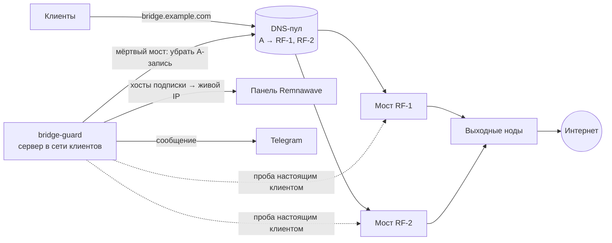

# bridge-guard — сторож мостов для Remnawave

**Проверяет мосты так, как их видят клиенты, и сам уводит трафик с мёртвого моста.**
Настоящий xray-клиент через каждый мост → выход в интернет. Не ответил три раза подряд —
мост уходит из DNS-пула и из хостов подписки на живой, в Telegram приходит сообщение.
Ожил — возвращается. Никаких зависимостей: Python 3 из коробки + бинарник Xray-core.

```
🌉 Сторож мостов
🔴 RF-2 (203.0.113.20) не проходит проверку 3 раз подряд — клиент через него не выходит в сеть.
DNS: A bridge.example.com → 203.0.113.20 убрана
хостов переведено на 203.0.113.10: 7 (бэкап hosts.20260921-114233.json)
Живые мосты: RF-1 (203.0.113.10). Новые подключения уйдут на них сразу, остальные — при автообновлении подписки.
```

---

## Почему обычный мониторинг тут не работает

Мост — это сервер в той же стране, что и клиенты; он принимает VLESS/Reality и отдаёт
трафик на выходные ноды за границей. У него три способа умереть, и только один ловится
проверкой порта:

| что случилось | ping | TCP на :2053 | панель | клиент |
|---|---|---|---|---|
| хостер выключил машину | ✗ | ✗ | «нода отключена» | не подключается |
| xray завис / контейнер перезапускается | ✓ | ✓ | «нода на связи» | висит |
| провайдер начал резать исходящий TCP моста | ✓ | ✓ | «нода на связи» | подключается и **не выходит в сеть** |

Две реальные истории, из-за которых написан этот сторож:

- **Ночью хостер выключил один из двух мостов.** У имени в DNS осталось две A-записи,
  и каждое второе подключение у всех клиентов попадало на труп. «Троит» восемь часов —
  пока владелец не проснулся и не удалил запись руками.
- **Мосту отрезали исходящие соединения за границу.** Сервер жив, порт отвечает, панель
  довольна. Клиенты подключаются и не могут открыть ни одного сайта.

Единственная проверка, равная «у клиента работает», — пройти путь клиента целиком:
Reality-рукопожатие на мосту → балансир → выходная нода → интернет. Сторож делает
именно это, раз в минуту, с сервера в той же сети, что и клиенты.

## Как это работает



Раз в минуту (systemd-таймер):

1. Через **каждый** мост поднимается xray-клиент с ключами вашего Reality-инбаунда и
   служебным пользователем панели; успех — если через него получен внешний IP.
2. `fail_n` провалов подряд → мост **мёртв**: A-запись моста убирается из DNS-пула,
   хосты подписки с адресом пула переводятся на IP живого моста (клиенты получат его
   при следующем автообновлении подписки), сообщение в Telegram.
3. `ok_n` успехов подряд у мёртвого → **ожил**: запись возвращается в DNS, хосты — на имя пула.
4. Если умерло больше `max_dead` мостов разом — это скорее сеть или сам сторож, чем мосты:
   автодействия замораживаются, приходит предупреждение.

Между событиями сторож молчит.

## Быстрый старт

Нужен сервер в той же стране, что клиенты (для российской аудитории — в России):
Ubuntu 22.04/24.04, root, Python 3.9+.

```bash
git clone https://github.com/ponoroshca/remnawave-bridge-guard.git
cd remnawave-bridge-guard
sudo ./scripts/install.sh          # скрипты в /opt/bridge-guard, Xray-core с проверкой суммы, юниты systemd
sudo nano /etc/bridge-guard/config.json
```

Откуда взять `probe.uuid`, `public_key`, `short_id` и как завести DNS-пул — в
[docs/panel-setup.md](docs/panel-setup.md). Дальше:

```bash
bridge-guard --dry-run                        # пробы и решения, ничего не меняется
bridge-guard --dry-run --fake-dead RF-2       # репетиция отказа моста RF-2
sudo systemctl enable --now bridge-guard.timer
journalctl -u bridge-guard.service -f
```

## Конфигурация

`/etc/bridge-guard/config.json` (пример — [examples/config.example.json](examples/config.example.json)):

| ключ | что это |
|---|---|
| `bridges[]` | мосты: `name` (для сообщений) и `ip` |
| `probe.port` | порт Reality-инбаунда мостов, через который ходят клиенты (обычно «Авто») |
| `probe.uuid` | `vlessUuid` служебного пользователя панели, состоящего в сквадах этого инбаунда |
| `probe.public_key`, `probe.short_id`, `probe.sni` | параметры Reality того же инбаунда — как в ссылке подписки |
| `probe.urls` | что открывать через мост; успех = в ответе IPv4 |
| `thresholds.fail_n` / `ok_n` | провалов подряд до «мёртв» / успехов подряд до «ожил» |
| `thresholds.max_dead` | больше мёртвых разом — заморозка автодействий |
| `failover.dns` | DNS-пул: провайдер (Cloudflare), файл с токеном, зона, имя, `min_pool` — меньше записей в пуле сторож не оставит |
| `failover.hosts` | хосты подписки с адресом `match_address` переводятся на IP живого моста; нужны `panel.url` и `panel.token` |
| `telegram` | бот, чат и (по желанию) прокси — на российских серверах api.telegram.org часто недоступен напрямую |

Можно использовать только DNS, только хосты или оба режима вместе: DNS даёт переключение
за минуту для новых подключений, хосты — для тех, у кого адрес прописан в подписке.

## Что сторож никогда не делает

- не трогает конфиги нод и профили панели — только адреса хостов и A-записи одного имени;
- не оставляет DNS-пул пустым (`min_pool`) и не переключает хосты, когда живых мостов нет;
- не действует, когда мёртвых «слишком много» (`max_dead`) — при сбое своей сети лучше
  промолчать, чем разнести рабочий пул;
- перед каждой правкой хостов сохраняет их копию в `/var/lib/bridge-guard/backups/`;
- в `--dry-run` не меняет ни DNS, ни хосты, ни своё состояние.

Откат руками в любой момент: вернуть A-запись в DNS и адрес хоста в панели — сторож
увидит живой мост и продолжит с чистого листа.

## Ещё два инструмента в комплекте

### exit-probe — «нода заблокирована или отрезан мост?»

Ставится **на мост** и раз в 30 минут проверяет TCP-достижимость всех выходных нод из
профиля плюс две контрольные точки. По их сочетанию сообщение говорит прямо, что чинить:

- заграничный контроль не открывается, российский открывается → **отрезан сам мост**,
  лечится новым IP у моста, ноды ни при чём;
- оба не открываются → у моста нет сети;
- контроль в порядке, нода нет → проблема ноды (если и с другого моста — блокировка по её IP).

Одна и та же проблема — одно сообщение в 6 часов, не поток.

```bash
./scripts/install-exit-probe.sh 203.0.113.10 "RF-Bridge" RF-1 ~/.ssh/id_ed25519
```

### lanes-probe — «у клиентов всё работает?» цифрами

Проходит каждый режим подписки (каждый инбаунд профиля мостов) через мост как настоящий
клиент: IP выхода, отклик, скорость скачивания.

```
$ lanes-probe --profile "RF-Bridge" --bridge 203.0.113.10
══ через 203.0.113.10 — как клиент (15:07:17) ══
  :2053 ⭐ Авто                        ✅ выход 203.0.113.10     отклик 290 мс  скачивание 86 Мбит/с
  :2054 🇺🇸 США                        ✅ выход 198.51.100.30    отклик 569 мс  скачивание 65 Мбит/с
  :2056 🇳🇱 Нидерланды                 ✅ выход 198.51.100.20    отклик 308 мс  скачивание 86 Мбит/с
  :2060 🇫🇮 Финляндия                  ✅ выход 198.51.100.10    отклик 193 мс  скачивание 85 Мбит/с
  итог: 4 из 4 режимов работают
```

## Совместимость

- Remnawave 2.x (API: `/api/hosts`, `/api/config-profiles`), Xray-core с Reality
- Python 3.9+, только стандартная библиотека; Ubuntu 22.04 / 24.04, Debian 12
- DNS: Cloudflare (токен с правом *DNS:Edit* на одну зону). Другой провайдер — класс на
  30 строк, см. [docs/dns.md](docs/dns.md)

## Документация

- [Как принимаются решения](docs/how-it-works.md) — состояния, счётчики, заморозка, откат
- [Настройка панели](docs/panel-setup.md) — служебный пользователь, ключи Reality, DNS-пул, хосты
- [DNS и Cloudflare](docs/dns.md)
- [exit-probe](docs/exit-probe.md) · [lanes-probe](docs/lanes-probe.md)
- [Вопросы и неполадки](docs/faq.md)

## Лицензия

MIT. Инструмент вырос из эксплуатации живых сервисов и отдаётся как есть — без гарантий,
но с желанием, чтобы ваши клиенты не «троили» восемь часов из-за одной A-записи.
