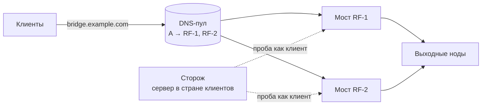

# Пошагово с нуля — 10 минут

Для тех, кто ставит такое впервые. Предполагается только, что у вас уже есть Remnawave
с мостами и вы умеете зайти на сервер по SSH и вставить команду. Всё остальное — здесь.

## Сначала — о чём речь



- **Мост** — ваш сервер в стране клиентов, к которому они подключаются; он передаёт трафик
  на выходные ноды за границей. Если у вас один мост — сторожу переключать некуда, но он
  всё равно скажет, когда мост умер (и почему обычный мониторинг этого не увидит).
- **Хост подписки** — строка в подписке клиента «подключайся к адресу X на порт Y». Адрес
  может быть IP моста или общим **именем** (DNS-пул): у имени несколько A-записей — по
  одной на мост, клиенты получают их по очереди.
- **Служебный пользователь** — обычный пользователь панели без лимита, от имени которого
  сторож подключается к мостам как клиент. Мастер заведёт его сам.
- **Инбаунд** — вход моста на определённом порту (обычно «Авто» на 2053); сторож ходит
  через тот же инбаунд, что и большинство клиентов.
- **Что происходит при отказе**: сторож три минуты подряд не может выйти в интернет через
  мост → убирает его A-запись из DNS (новые подключения сразу идут на живой мост) и
  переписывает адрес хостов с этого моста на живой (те, у кого адрес в подписке, получат
  его при следующем обновлении подписки — обычно в течение часа или при открытии
  приложения). Мост ожил → всё возвращается. Ничего на самих мостах сторож не меняет.

## Что понадобится

| | что | есть? |
|---|---|---|
| 1 | **Сервер для сторожа** в стране ваших клиентов (для России — в России). Любой VPS: 1 ядро, 1 ГБ, Ubuntu 22.04/24.04 или Debian 12, доступ root. **Не сам мост** и не панель — можно взять сервер, где живёт ваш бот, если он в той же стране | ☐ |
| 2 | **API-токен панели** Remnawave | ☐ |
| 3 | **Отдельный Telegram-бот** для тревог (одна минута у @BotFather) | ☐ |
| 4 | **Токен Cloudflare** — только если DNS вашего домена на Cloudflare и вы хотите DNS-пул. Без него тоже работает | ☐ |

Ниже — как получить 2, 3 и 4 по кликам. Получили — переходите к шагу 4.

## Шаг 1. Токен панели

1. Откройте панель Remnawave в браузере, войдите.
2. Слева внизу (или в меню) — **API Tokens** → **Create**.
3. Имя: `bridge-guard`. Создать.
4. Скопируйте токен **сразу** — панель показывает его один раз. Положите в заметки.

Что делает сторож с этим токеном: читает список нод, профилей, сквадов и хостов;
создаёт одного служебного пользователя; при отказе моста меняет адрес у хостов подписки.
Больше ничего.

## Шаг 2. Бот в Telegram

1. В Telegram откройте **@BotFather** → напишите `/newbot`.
2. Он спросит имя — любое, например `Сторож мостов`.
3. Потом username — латиницей, должен кончаться на `bot`, например `my_bridge_guard_bot`.
4. BotFather ответит сообщением с токеном вида `123456789:AAF…` — скопируйте его.

**Не используйте бота вашего магазина/сервиса** — он уже занят своей программой, и
второй читатель ему помешает. Отдельный бот — это нормально и правильно.

Кто будет получать тревоги — сторож определит сам: во время настройки он попросит открыть
нового бота и нажать **Start**.

## Шаг 3. Cloudflare (если DNS вашего домена там)

1. dash.cloudflare.com → справа вверху профиль → **My Profile** → **API Tokens** → **Create Token**.
2. Шаблон **Edit zone DNS** → Use template.
3. В **Zone Resources**: Include → Specific zone → выберите ваш домен.
4. Continue to summary → **Create Token** → скопируйте.

Записи DNS для мостов создавать руками не нужно — сторож предложит создать их сам,
с правильным TTL и без «оранжевого облака».

Если DNS не на Cloudflare — пропустите шаг: сторож будет переключать адреса прямо в
хостах подписки (для этого ничего дополнительно не нужно).

## Шаг 4. Одна команда на сервере

Зайдите на сервер сторожа по SSH под root и вставьте:

```bash
curl -fsSL https://raw.githubusercontent.com/ponoroshca/remnawave-bridge-guard/main/scripts/install.sh | sudo bash
```

Полминуты — и запустится мастер. Он спрашивает по одному, у каждого вопроса написано,
где взять ответ; Enter — принять то, что в квадратных скобках. Токены при вводе не
отображаются — это нормально, просто вставьте и нажмите Enter. Что вы увидите
(адреса и имена — для примера):

```
── 1/6 Панель Remnawave ──
  Где взять: адрес — тот, по которому вы открываете панель в браузере.
  API-токен: в панели → API Tokens → Create → имя bridge-guard → скопировать (показывается один раз).
адрес панели (https://panel.example.com): https://panel.ваш-домен
API-токен панели:                            ← вводите токен; на экране он не показывается
  ✅ панель отвечает, профилей 3, нод 6

── 2/6 Мосты ──
   1. * RF-1                 203.0.113.10     RU   профиль Bridges
   2. * RF-2                 203.0.113.20     RU   профиль Bridges
   3.   Finland              198.51.100.10    FI   профиль Exits
  (* — предложены по умолчанию; входы платных продуктов и обычные ноды из списка уберите)
номера мостов через запятую (те, через которые ходят клиенты) [1,2]:      ← Enter, если звёздочки там, где надо
  мосты: все ноды профилей Bridges — новые ноды на этих профилях подхватятся сами

── 3/6 Инбаунд и параметры клиента ──
   1. :2053   хостов подписки 4   Bridges:VLESS-IN
номер порта, которым пользуется большинство клиентов [1]:
  ✅ RF-1                 :2053 VLESS-IN               reality/tcp sni www.cloudflare.com flow
  ✅ RF-2                 :2053 VLESS-IN               reality/tcp sni www.cloudflare.com flow

── 4/6 Служебный пользователь ──
  Проба ходит через мост как обычный клиент — для этого в панели нужен отдельный пользователь без лимита.
имя служебного пользователя (Enter — оставить) [bridge-probe]:
  сквады для пробы: Default
создать пользователя bridge-probe в сквадах Default (срок 10 лет, без лимита) [Y/n]:
  ✅ создан bridge-probe

── 5/6 Куда переключать ──
  Два способа увести клиентов с мёртвого моста (можно оба):
   • DNS-пул — одно имя (например bridge.ваш-домен) с A-записью на каждый мост; сторож убирает мёртвый из DNS. Нужен домен на Cloudflare.
   • хосты подписки — сторож переписывает адрес хоста на живой мост; клиенты получат его при обновлении подписки.
имя DNS-пула на Cloudflare (Enter — пропустить, будут только хосты): bridge.ваш-домен
зона (домен) в Cloudflare [ваш-домен]:
  Где взять: dash.cloudflare.com → My Profile → API Tokens → Create Token → шаблон «Edit zone DNS» → …
токен Cloudflare:                            ← ввод не показывается
  ✅ Cloudflare видит зону; в пуле bridge.ваш-домен: пусто
создать A-записи bridge.ваш-домен → 203.0.113.10, 203.0.113.20 (TTL 60, без прокси) [Y/n]:
     ✅ A bridge.ваш-домен → 203.0.113.10 создана
     ✅ A bridge.ваш-домен → 203.0.113.20 создана
  в панели нет хоста подписки с адресом bridge.ваш-домен — без него клиенты не узнают о пуле
создать хост «Авто (пул мостов)» → bridge.ваш-домен:2053 на инбаунде Bridges:VLESS-IN [y/N]: y
     ✅ хост создан; sni/отпечаток при необходимости поправьте в панели
переводить и хосты подписки на живой мост (адреса: 203.0.113.10, 203.0.113.20, bridge.ваш-домен) [Y/n]:

── 6/6 Telegram ──
  Тревоги приходят в Telegram. Нужен ОТДЕЛЬНЫЙ бот: в Telegram откройте @BotFather → /newbot →
  придумайте имя и username (оканчивается на bot) → скопируйте токен вида 123456789:AAF…
токен бота (Enter — без Telegram):           ← ввод не показывается
  бот найден: @my_bridge_guard_bot. Откройте https://t.me/my_bridge_guard_bot и нажмите Start (или напишите ему что угодно).
  жду сообщение до 90 с…
  ✅ получатель: Иван (chat_id 123456789)
  telegram: отправлено                        ← в Telegram пришло тестовое сообщение
  ✅ конфиг записан: /etc/bridge-guard/config.json

── Проверка по-настоящему ──
  ✅ RF-1 203.0.113.10
  ✅ RF-2 203.0.113.20

── Репетиция отказа (ничего не меняется) ──
прислать эту репетицию в Telegram как тестовую тревогу (так будет выглядеть настоящая) [Y/n]:
  RF-1 203.0.113.10: ПРОВАЛ (провалов подряд 3, успехов 0, жив)
  RF-2 203.0.113.20: ок (провалов подряд 0, успехов 1, жив)
  🔴 RF-1 (203.0.113.10) не проходит проверку 3 раз подряд — клиент через него не выходит в сеть.
  [dry-run] DNS: убрал бы A bridge.ваш-домен → 203.0.113.10
  [dry-run] хостов перевёл бы на 203.0.113.20: 1
  Живые мосты: RF-2 (203.0.113.20). Новые подключения уйдут на них сразу, остальные — при автообновлении подписки.
  telegram: отправлено
включить таймер (проверка раз в минуту) [Y/n]:
  ✅ таймер включён

Готово. Проверка: bridge-guard doctor · состояние: bridge-guard status · журнал: journalctl -u bridge-guard.service -f
```

Если где-то ❌ — мастер пишет, что именно не так. Исправили — запустите `bridge-guard setup`
ещё раз: он предложит прошлые ответы, менять придётся только нужное.

## Что произойдёт при настоящем отказе — по минутам

| время | что делает сторож | что видит клиент |
|---|---|---|
| 0:00 | мост перестал выпускать в интернет | у тех, кто на нём, ничего не открывается |
| 0:01–0:03 | три провала подряд | то же |
| 0:03 | A-запись убрана из DNS, хосты переведены, сообщение в Telegram | новые подключения (перезапуск приложения) идут на живой мост; кто сидит на мёртвом — переподключается по обновлению подписки |
| дальше, раз в минуту | проверяет мёртвый мост | — |
| ожил, три успеха подряд | запись и хосты возвращены, сообщение | клиенты снова распределяются по обоим мостам |

Чтобы клиенты подхватывали быстрее, поставьте в шаблоне подписки интервал обновления
(`profileUpdateInterval`) в 1 час — приложения обновят адреса сами.

## Шаг 5. Убедиться, что работает

```bash
bridge-guard doctor
```

Все строки должны быть ✅ (кроме мостов, которые действительно мертвы). В Telegram за время
настройки должны были прийти два сообщения: тестовое и репетиция отказа с пометкой 🧪.

Дальше сторож молчит, пока всё хорошо. Раз в сутки — короткая строка «проверок N, сторож жив».

## Если что-то не так

| вы видите | что это значит | что сделать |
|---|---|---|
| `панель ответила 401` | токен неверный или обрезан | заново скопируйте токен из панели |
| `панель не ответила` | адрес не тот или панель закрыта для этого сервера | адрес с `https://`; откройте панель в браузере с этого же адреса |
| в списке мостов нет вашего моста | нода без IP-адреса или без профиля в панели | проверьте карточку ноды в панели |
| проба ❌ через **все** мосты | служебный пользователь не в сквадах инбаунда или выбран не тот порт | `bridge-guard setup` → выберите порт, которым реально пользуются клиенты |
| проба ❌ через **один** мост | мост действительно не выпускает клиентов в сеть | это и есть работа сторожа; проверьте мост |
| `токен не принят Telegram` | токен бота скопирован не целиком | из сообщения BotFather скопируйте всю строку вида `123456789:AAF…` |
| `этот бот уже используется другой программой` | вы ввели токен рабочего бота | создайте отдельного бота у @BotFather |
| Telegram «НЕ отправился» | с сервера в РФ api.telegram.org недоступен | укажите HTTP-прокси, когда мастер спросит (подойдёт ваш же VPN-выход) |
| `зона не найдена` (Cloudflare) | токен выдан не на ту зону или без права Edit zone DNS | пересоздайте токен по шагу 3 |
| сторож что-то переключил, а вы не хотели | | `bridge-guard rollback` вернёт хосты и DNS как было |
| хочу снести всё | | `sudo /opt/bridge-guard/uninstall.sh` |

Полный список вопросов — в [faq.md](faq.md), что сторож делает и чего не делает с вашей
системой — в [SAFETY.md](SAFETY.md).
